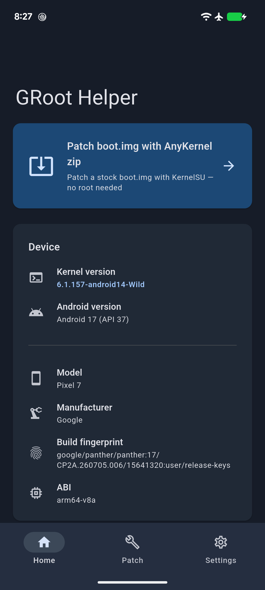
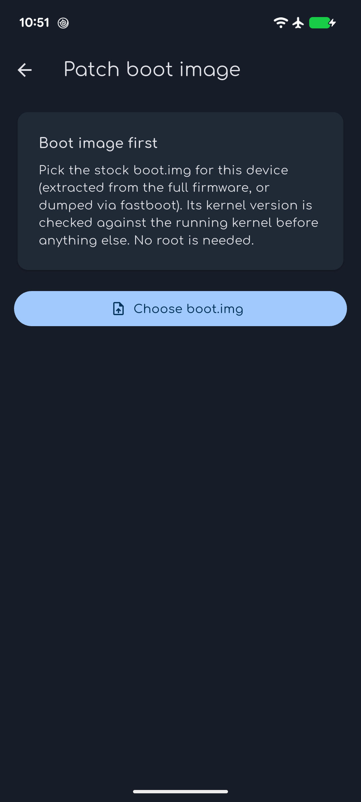
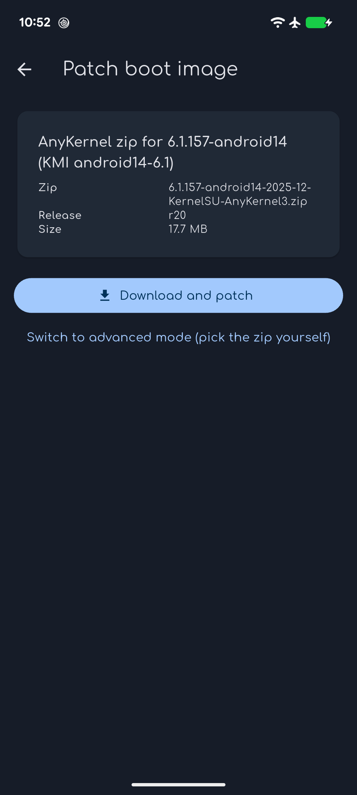
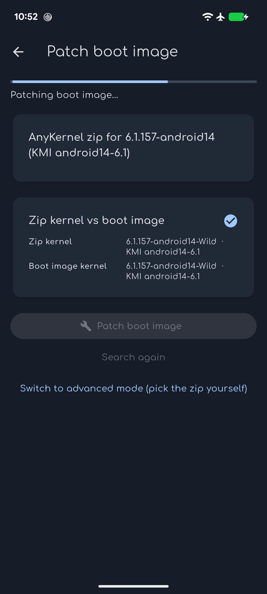
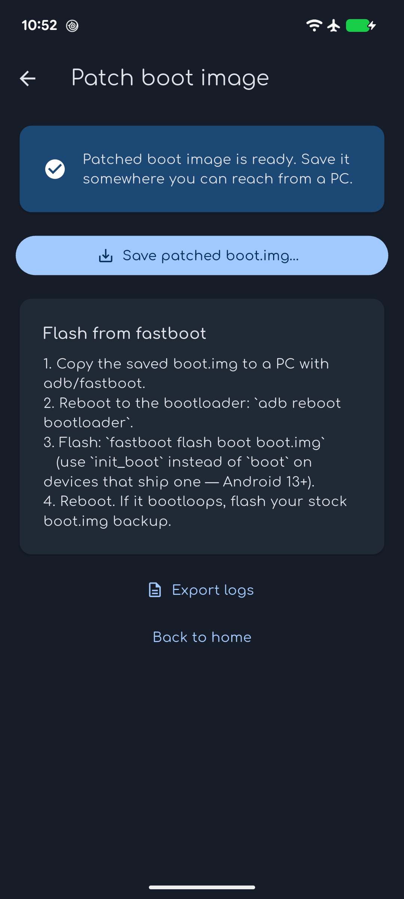
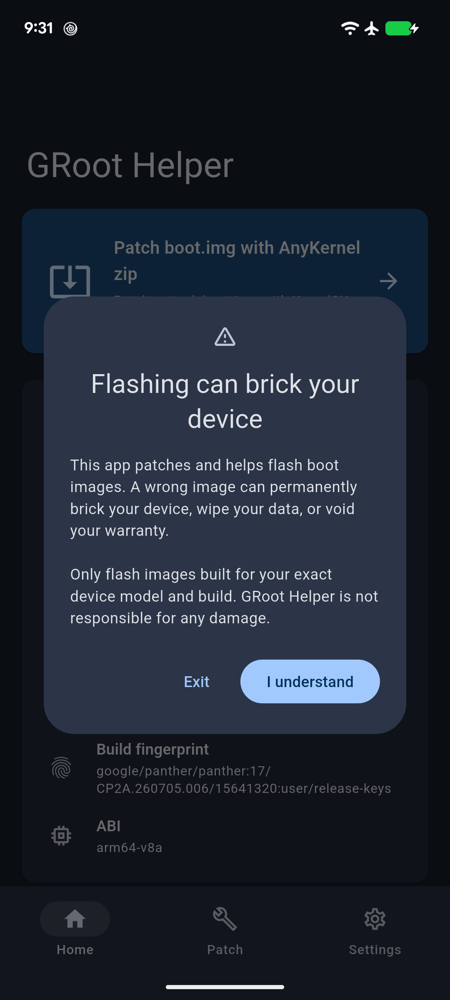
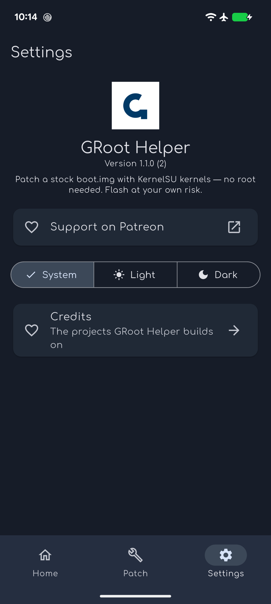
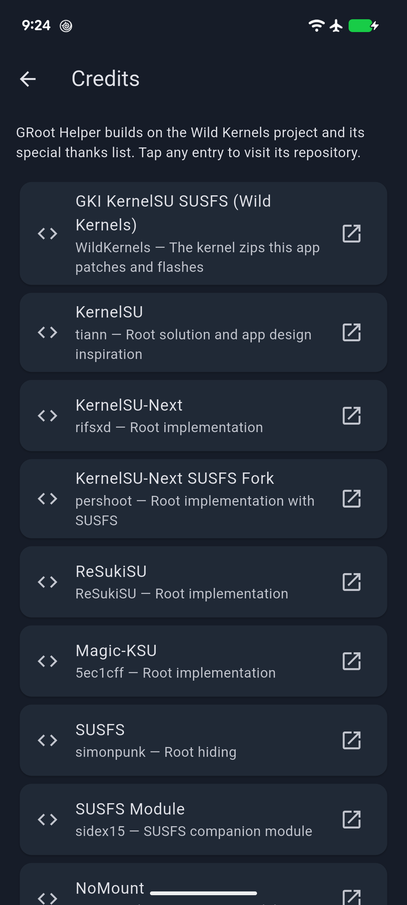

<p align="center">
  
</p>

<h1 align="center">GRoot Helper</h1>

<p align="center">
  Patch a stock <code>boot.img</code> with a KernelSU-family kernel — <strong>no root needed</strong>.
</p>

<p align="center">
  <a href="https://github.com/pyshivam/Geergit-Root-Helper/actions/workflows/release.yml">
    
  </a>
  
  
</p>

| Home | Boot selection | Zip selection | Patching |
|---|---|---|---|
|  |  |  |  |

| Patched & flash guide | Disclaimer | Settings | Credits |
|---|---|---|---|
|  |  |  |  |

## What it does

GRoot Helper patches a stock Android `boot.img` with a [KernelSU](https://github.com/tiann/KernelSU)-family kernel — KernelSU, KernelSU-Next or ReSukiSU, whichever you pick — entirely on-device, without requiring root. You get a rooted boot image to fastboot-flash, without a PC and without touching your system partition.

The app lists the prebuilt AnyKernel builds the [Wild Kernels repos](https://github.com/WildKernels/GKI_KernelSU_SUSFS) publish for your kernel's exact patch level, unpacks your stock `boot.img` with `magiskboot`, swaps the kernel for the build you selected, and repacks it — the same recipe Magisk/KernelSU flash zips use, driven from a phone UI. The matching manager app and the release's module zips are downloadable from the same page.

> ⚠️ **Flashing can brick your device.** A wrong boot image can permanently brick your device, wipe data, or void warranty. Only flash images built for your exact device model and build. The app shows a risk disclaimer on first launch — read it.

## Features

- **Two patch modes**
  - **Simple** — pick your stock `boot.img`; the app finds every root manager build published for your kernel's patch level (KernelSU, KernelSU-Next, ReSukiSU…) and you choose which root to patch for.
  - **Advanced** — bring your own AnyKernel zip (any Wild Kernels repo: GKI, Pixel/Sultan, Samsung, OnePlus).
- **On-device patching** — `magiskboot` runs inside the app via JNI (W^X-safe, unrooted-friendly); nothing leaves the device.
- **Supporting downloads** — the manager app to install after flashing (including its spoofed build) and the module zips published with the kernel, saved to storage from the same page. Kernel payloads (prebuilt boot images, image bundles) are never offered.
- **Zip-step prompts** — every flash decision shows the kernel patch level you're about to apply.
- **Flashing guide** — a step-by-step guide from patched image to fastboot flash.
- **File-based session logging** — every patch try is logged to on-device files with crash hooks and device facts; exportable as a zip via Android's share sheet (10 sessions retained).
- **Full theming** — light/dark/system with persistence, navy palette derived from the GRoot Helper logo, designed dark surfaces.
- **Comfortaa typography**, user-authored G logo on the launcher icon, splash, and in-app.
- **Device identity card** — kernel version (highlighted), Android version, model, manufacturer, build fingerprint, ABI.
- **Support & credits** — Patreon link; a credits page thanking every project the app builds on (Wild Kernels special thanks list, verbatim links).

## How patching works

```
stock boot.img ──► magiskboot unpack ──► swap in the chosen root's kernel
                                          (KernelSU-family kernel)
                 ──► magiskboot repack ──► patched boot.img
                 ──► fastboot flash (guide in-app)
```

The patcher validates that the input really is an ARM64 kernel image before touching it (`0x644D5241` magic at offset 56).

## Usage

1. Get your stock `boot.img` (extract from the factory image for your exact build).
2. Open GRoot Helper → **Patch boot.img with AnyKernel zip**.
3. Simple: pick the boot image, then pick the root manager to patch for (KernelSU, KernelSU-Next, ReSukiSU…). Advanced: also pick your own zip.
4. Optionally save the matching manager app and the release's module zips from the same page.
5. Follow the flashing guide to fastboot-flash the patched image, then install the manager app you saved.

Requires a GKI 2.0 device (kernel 5.10+) for the generic zips; Pixel/Samsung/OnePlus repos cover more.

## Building

Toolchain is pinned via [fvm](https://fvm.app) (`.fvmrc` → Flutter 3.47.4):

```sh
fvm flutter pub get
fvm flutter analyze
fvm flutter test
fvm flutter build apk --debug   # or --release with a keystore
```

## Release flow

- Work lands on `dev` as WIP commits.
- Merging `dev` → `main` triggers CI: quality gate → signed release APK → GitHub Release.
- The release (and tag) is named from the commit it was built from: `1.0.0-abcdef0+1`.
- Docs-only merges to `main` skip the build (path-filtered).

## Tech

- Flutter 3.47.4, Material 3, `go_router` shell routes
- `magiskboot` bundled natively (per-ABI), driven over JNI
- File-based persistence (logs, theme, disclaimer ack) — no SharedPreferences
- Signed release builds via CI secrets; version-stamped by commit SHA

## Credits

Full list in-app (Settings → Credits), from the Wild Kernels special thanks: KernelSU, KernelSU-Next, ReSukiSU, Magic-KSU, SUSFS, NoMount, DroidSpaces, Baseband-guard, WildKernels/kernel_patches, AnyKernel3, Sultan kernels, Magisk, Flutter, and the boot-fix commit.

Support development on [Patreon](https://www.patreon.com/cw/pyshivam/membership).

## License

GPL-3.0 — see [LICENSE](LICENSE).
